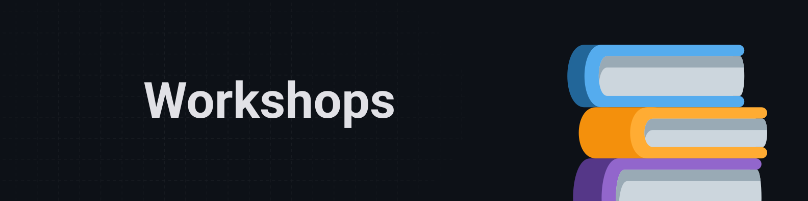

   

   

  

   

   

   

 

## 📚 Sobre

Este repositório centraliza exercícios, desafios e projetos práticos envolvendo:

- JavaScript/TypeScript
- Node.js
- ReactJS
- React Native

O objetivo é acompanhar a evolução contínua com a stack JavaScript.

## 🌳 Branches

Os projetos contidos nesse repositórios estão divididos em branches:

- [`main`](https://github.com/omarcoaur3lio/formacao-js-ts/tree/main) → Estrutura base e ponto de partida para novas trilhas.
- [`ignite-trilha-2025`](https://github.com/omarcoaur3lio/formacao-js-ts/tree/ignite-trilha-2025) → Projetos da trilha **Ignite 2025** da Rocketseat.
- [`ignite-trilha-2022`](https://github.com/omarcoaur3lio/formacao-js-ts/tree/ignite-trilha-2022) → Projetos da trilha **Ignite 2022** da Rocketseat.
- [`workshops`](https://github.com/omarcoaur3lio/formacao-js-ts/tree/workshops) → Projetos avulsos, eventos, bootcamps e testes.

Novas branches podem surgir conforme novas formações sejam iniciadas.

