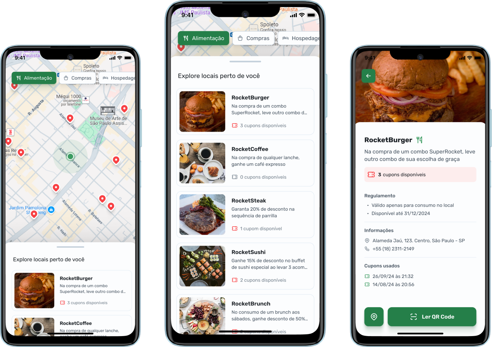

   

   

   

   

O objetivo dessa branch é armazenar projetos desenvolvidos em caráter de estudo, podendo ser de um conceito, tecnologia, padrão de projeto ou metodologia de desenvolvimento.

# 📚 Projetos

Clique nas screenshots dos projetos para acessar o código-fonte do projeto.

### Nearby

Aplicativo de clube de benefícios, semelhante ao iFood, onde você pode encontrar estabelecimentos parceiros próximos, ativar cupons e aproveitar vantagens exclusivas. Desenvolvido em Kotlin com o objetivo de fortalecer conceitos do desenvolvimento nativo de apps android.

<table>
    <tbody>
      <tr>
         <td><h4>Screenshot</h4></td>
         <td width="50%"><h4>Objetivos:</h4></td>
      </tr>
      <tr>
         <td align="center">
            
         </td>
         <td>
            <ul>
               <li>Fundamentos da linguagem Kotlin</li>
               <li>Fundamentos do Jetpack Compose</li>
               <li>Uso da biblioteca Coil para carregamento performático de imagens</li>
            </ul>
         </td>
      </tr>
   </tbody>
</table>
