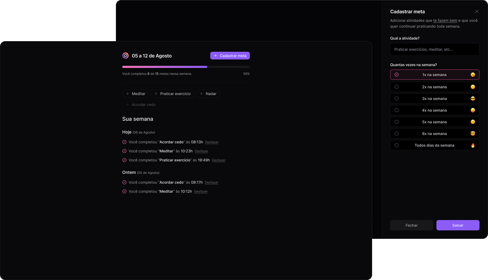
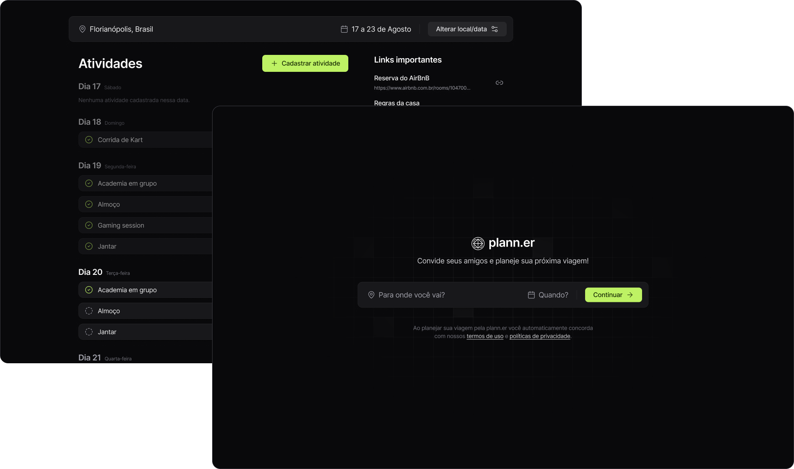
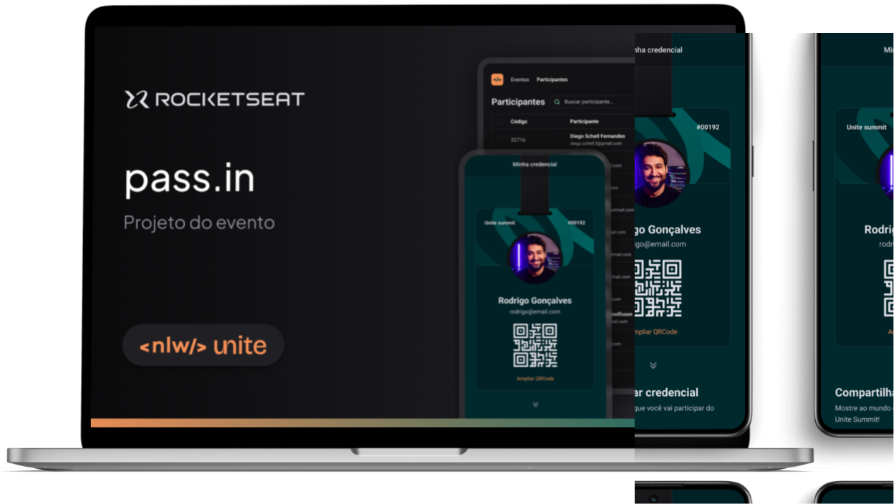
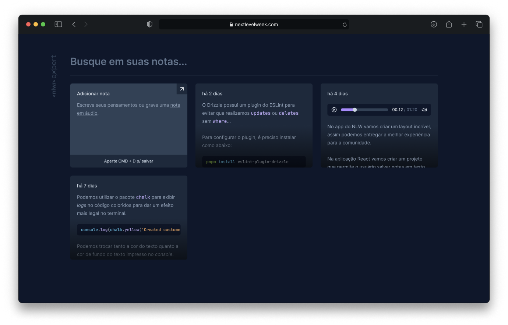
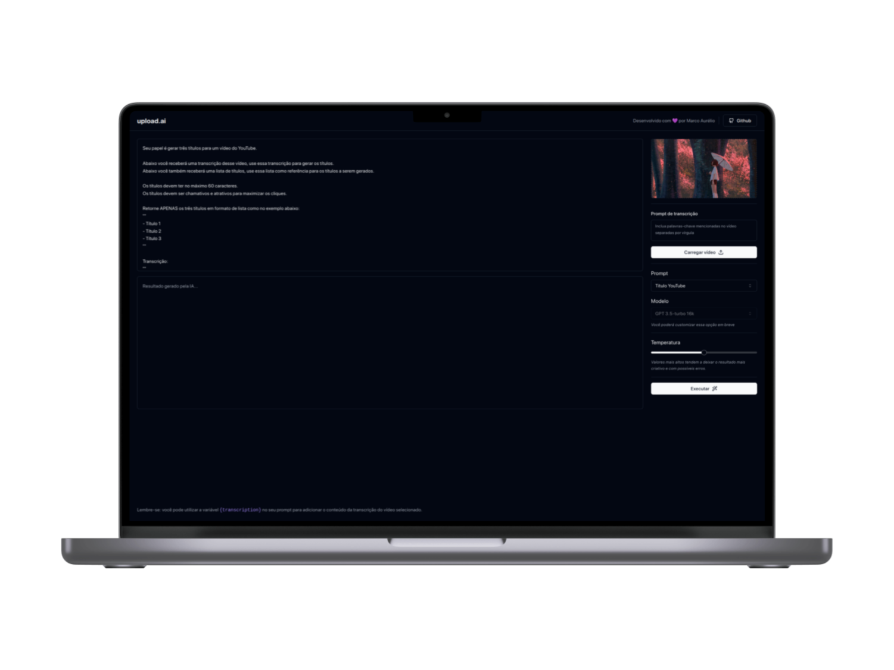
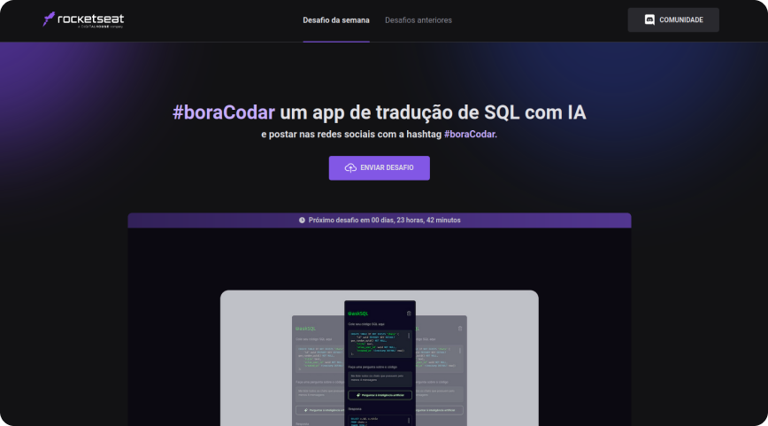
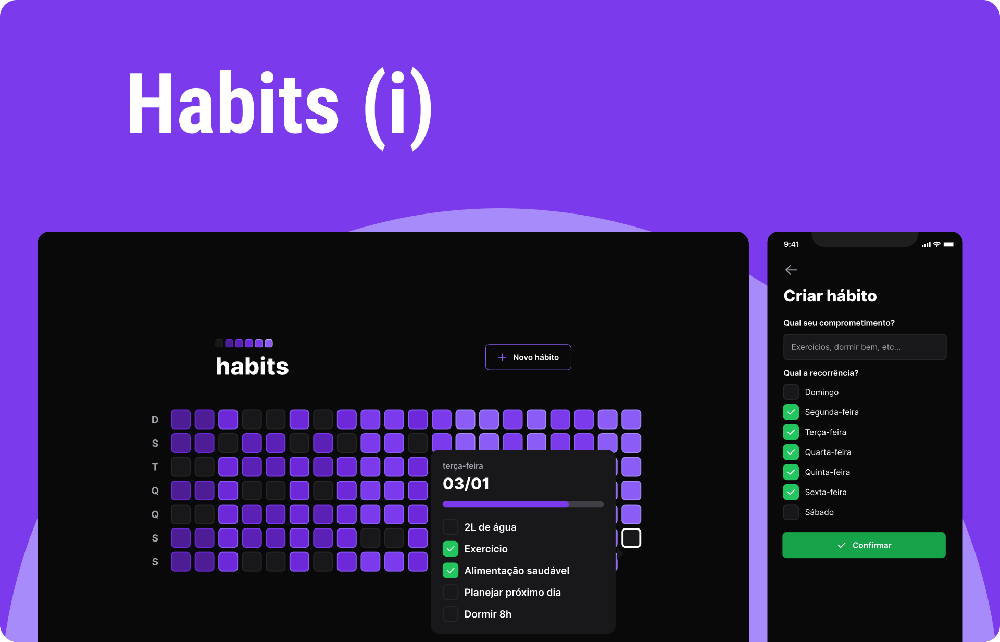
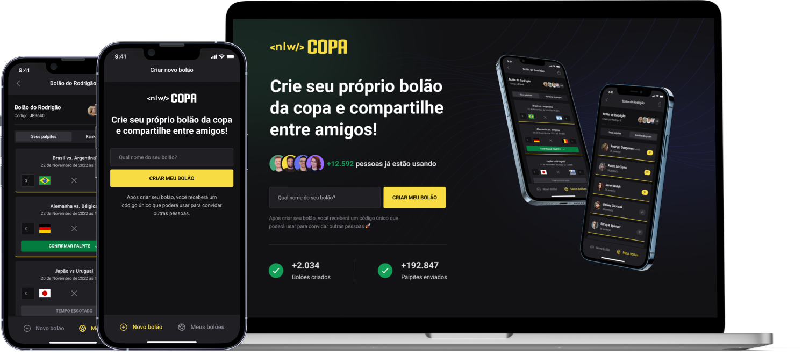
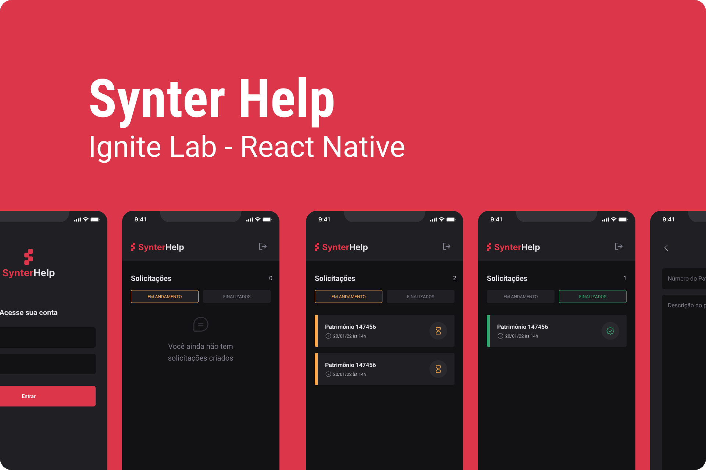
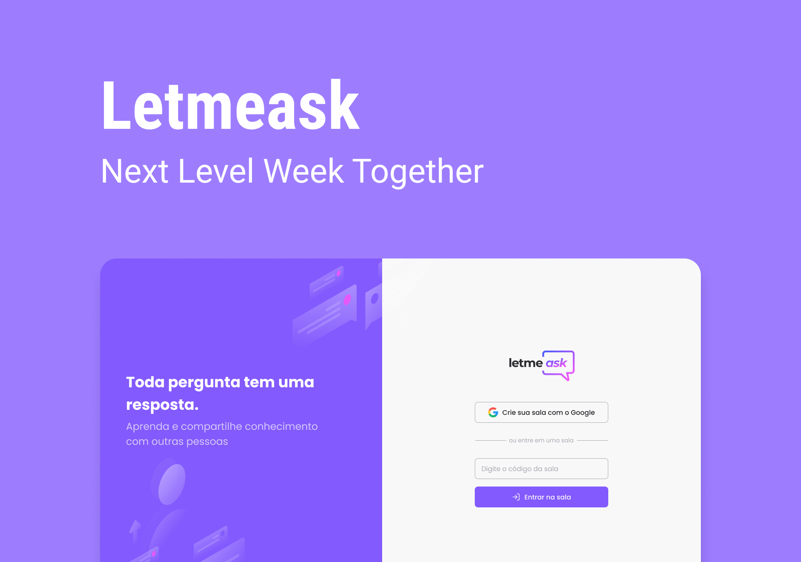

   

   

   

   

O objetivo dessa branch é armazenar projetos desenvolvidos em caráter de estudo, podendo ser de um conceito, tecnologia, padrão de projeto ou metodologia de desenvolvimento.

# 🧬 Projetos

Clique nas screenshots dos projetos para acessar o código-fonte do projeto.

### Nearby

Aplicativo de clube de benefícios, semelhante ao iFood, onde você pode encontrar estabelecimentos parceiros próximos, ativar cupons e aproveitar vantagens exclusivas. Desenvolvido em Kotlin com o objetivo de fortalecer conceitos do desenvolvimento nativo de apps android.

<table>
    <tbody>
      <tr>
         <td><h4>Screenshot</h4></td>
         <td width="50%"><h4>Objetivos</h4></td>
      </tr>
      <tr>
         <td align="center">
            
         </td>
         <td>
            <ul>
               <li>Fundamentos da linguagem Kotlin</li>
               <li>Fundamentos do Jetpack Compose</li>
               <li>Uso da biblioteca Coil para carregamento performático de imagens</li>
            </ul>
         </td>
      </tr>
   </tbody>
</table>

### in.orbit

Aplicativo web para cadastro de metas a serem alcançadas durante a semana.

<table>
    <tbody>
      <tr>
         <td><h4>Screenshot</h4></td>
         <td width="50%"><h4>Objetivos</h4></td>
      </tr>
      <tr>
         <td align="center">
            
         </td>
         <td>
            <ul>
               <li>Fundamentos de Javascript com React</li>
               <li>Estilização com TailwindCSS</li>
               <li>Consumo de APIs com uso do React Query</li>
               <li>Criação de API com Fastify</li>
               <li>Utilização do Drizzle ORM</li>
               <li>Desenvolvimento de queries SQL para consultas em banco PostgreSQL</li>
            </ul>
         </td>
      </tr>
   </tbody>
</table>

### Planner

Aplicação para montar planos de viagem com amigos, registrar atividades e links úteis. O projeto front-end foi desenvolvido em React e a API em NodeJS.

<table>
    <tbody>
      <tr>
         <td><h4>Screenshot</h4></td>
         <td width="50%"><h4>Objetivos</h4></td>
      </tr>
      <tr>
         <td align="center">
            
         </td>
         <td>
            <ul>
               <li>Fundamentos de React</li>
               <li>Estilização com TailwindCSS</li>
               <li>Consumo de APIs com Axios</li>
               <li>Criação de API com Fastify</li>
               <li>Tratamento de erros</li>
               <li>Envio de e-mail com nodemailer</li>
            </ul>
         </td>
      </tr>
   </tbody>
</table>

### Pass.in

Aplicação full-stack (back-end, web e mobile) de gestão de participantes em eventos presenciais. A ferramenta permite que o organizador cadastre um evento e abra uma página pública de inscrição. Os participantes inscritos podem emitir uma credencial para check-in no dia do evento. O sistema fará um scan da credencial do participante para permitir a entrada no evento.

<table>
    <tbody>
      <tr>
         <td><h4>Screenshot</h4></td>
         <td width="50%"><h4>Objetivos</h4></td>
      </tr>
      <tr>
         <td align="center">
            
         </td>
         <td>
            <ul>
               <li>Fundamentos de React (estados, propriedades, imutabilidade, etc)</li>
               <li>Uso do LocalStorage</li>
               <li>Utilização de URL State</li>
               <li>utilização do Expo</li>
               <li>Utilização do NativeWind</li>
               <li>Persistências de dados com Zustand e AsyncStorage</li>
               <li>Animações com React Reanimated e Moti</li>
            </ul>
         </td>
      </tr>
   </tbody>
</table>

### NLW Notes

Aplicação para criação de notas de texto ou realização a transcrição de áudio para texto utilizando a API SpeechRecognition nativa do browser.

<table>
    <tbody>
      <tr>
         <td><h4>Screenshot</h4></td>
         <td width="50%"><h4>Objetivos</h4></td>
      </tr>
      <tr>
         <td align="center">
            
         </td>
         <td>
            <ul>
               <li>Fundamentos de React (estados, propriedades, imutabilidade, etc)</li>
               <li>Uso do LocalStorage</li>
               <li>Utilização da API SpeechRecognition</li>
            </ul>
         </td>
      </tr>
   </tbody>
</table>

### Upload.ai

O projeto consiste em um gerador de descrições e títulos de vídeos a partir da transcrição de seu conteúdo usando inteligência artificial.

<table>
    <tbody>
      <tr>
         <td><h4>Screenshot</h4></td>
         <td width="50%"><h4>Objetivos</h4></td>
      </tr>
      <tr>
         <td align="center">
            
         </td>
         <td>
            <ul>
               <li>Fundamentos de React</li>
               <li>Criação de interface com RadixUI</li>
               <li>Utilização da API da OpenAI</li>
            </ul>
         </td>
      </tr>
   </tbody>
</table>

### Bora Codar

Nesse projeto estão contidos pequenos desafios de desenvolvimento de software, abordando diversos assuntos, tecnologias, bibliotecas, etc.

<table>
    <tbody>
      <tr>
         <td><h4>Screenshot</h4></td>
         <td width="50%"><h4>Objetivos</h4></td>
      </tr>
      <tr>
         <td align="center">
            
         </td>
         <td>
            <ul>
               <li>Fundamentos de Javascript/Typescript</li>
               <li>Uso de HTML/CSS</li>
            </ul>
         </td>
      </tr>
   </tbody>
</table>

### Habits

Com essa aplicação é possível criar uma lista de hábitos para incorporar à sua rotina, e acompanhar através do resumo apresentado na aplicação, a frequência com que cada hábito está sendo praticado, permitindo que você visualize seu progresso ao longo do tempo e se motive a seguir em frente.

<table>
    <tbody>
      <tr>
         <td><h4>Screenshot</h4></td>
         <td width="50%"><h4>Objetivos</h4></td>
      </tr>
      <tr>
         <td align="center">
            
         </td>
         <td>
            <ul>
               <li>Fundamentos de Javascript/Typescript</li>
               <li>Uso de TailwindCSS</li>
               <li>Utilização da biblioteca NativeWind</li>
               <li>Utilização da biblioteca Reanimated</li>
               <li>Uso do Fastify</li>
            </ul>
         </td>
      </tr>
   </tbody>
</table>

### NLW Copa

Aplicação full-stack onde podemos criar "bolões" para realização de palpites dos jogos da copa do mundo de futebol 2022. A aplicação conta com uma interface Web feita em React (apenas para criação de bolões), um back-end desenvolvido em Node.js e um App mobile feito em React Native.

<table>
    <tbody>
      <tr>
         <td><h4>Screenshot</h4></td>
         <td width="50%"><h4>Objetivos</h4></td>
      </tr>
      <tr>
         <td align="center">
            
         </td>
         <td>
            <ul>
               <li>Fundamentos de Javascript/Typescript</li>
               <li>Uso de TailwindCSS</li>
               <li>Utilização da biblioteca NativeWind</li>
               <li>Utilização da biblioteca Reanimated</li>
               <li>Uso do Fastify</li>
               <li>Uso do Prima ORM + Zod</li>
            </ul>
         </td>
      </tr>
   </tbody>
</table>

### Synter Help

Essa aplicação tem como objetivo o cadastro de tarefas (ou solicitações 🙃) para serem realizadas/atendidas. O App permite o cadastro de novas solicitações além da exibição das tarefas cadastradas filtradas pelo seu estado (em andamento ou concluída).

<table>
    <tbody>
      <tr>
         <td><h4>Screenshot</h4></td>
         <td width="50%"><h4>Objetivos</h4></td>
      </tr>
      <tr>
         <td align="center">
            
         </td>
         <td>
            <ul>
               <li>Fundamentos de Javascript/Typescript</li>
               <li>Uso de Expo</li>
               <li>Expo bare workflow</li>
               <li>Utilização da NativeBase</li>
            </ul>
         </td>
      </tr>
   </tbody>
</table>

### FeedbackWidget

O App tem o objetivo de ser um meio para envios de feedbacks à aplicação na qual ele for inserido, seja ela web ou mobile.

<table>
    <tbody>
      <tr>
         <td><h4>Screenshot</h4></td>
         <td width="50%"><h4>Objetivos</h4></td>
      </tr>
      <tr>
         <td align="center">
            
         </td>
         <td>
            <ul>
               <li>Fundamentos de Javascript/Typescript</li>
               <li>Uso do Vite</li>
            </ul>
         </td>
      </tr>
   </tbody>
</table>

### Letmeask

A aplicação tem como objetivo ajudar os criadores de conteúdo na obtenção de perguntas por meio da plataforma com sistema de ranqueamento com base em curtidas ✨.

Como funciona? Crie uma sala para receber perguntas. Ao criar, um código será gerado e você poderá compartilhá-lo para que outras pessoas possam entrar na sala e mandar perguntas.

<table>
    <tbody>
      <tr>
         <td><h4>Screenshot</h4></td>
         <td width="50%"><h4>Objetivos</h4></td>
      </tr>
      <tr>
         <td align="center">
            
         </td>
         <td>
            <ul>
               <li>Fundamentos de Javascript/Typescript</li>
               <li>Uso do Firebase</li>
            </ul>
         </td>
      </tr>
   </tbody>
</table>