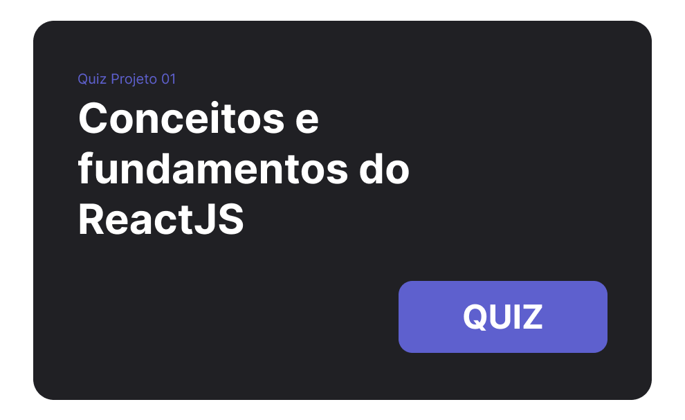

   

   

   

<a aria-label="Completed" href="https://rocketseat.com.br/">
    </img>
</a>

   

   

O Ignite :rocket: é um programa para estudo de novas tecnologias, através de um currículo extremamente prático, que impulsiona seus alunos através de uma metodologia de aprendizado eficiente baseada em **Foco**, **Prática** e **Grupo**, sempre pensando nos desafios do mundo real.

# Trilha React

A trilha React é focada nos principais conceitos e tecnologias de front-end, onde aprendemos a construir interfaces modernas e reativas de forma modular e escalável.

## 📚 Níveis

### :rocket: Nível I
**Fundamentos do React.js**
 
Nesse módulo foi estudado DOM x Virtual DOM, árvore de renderização, reconciliação, como reutilizar código por meio de componentes e as formas de rodar projetos com React.

<table>
    <tbody>
        <tr>
            <td><h3>:computer: Projeto</h3></td>
            <td><h3>:heavy_check_mark: Quiz</h3></td>
        </tr>
     </tr>
      <tr>
         <td align="center">
            <h4>Ignite Feed</h4>
            
         </td>
         <td>
            
         </td>
      </tr>
   </tbody>
</table>
