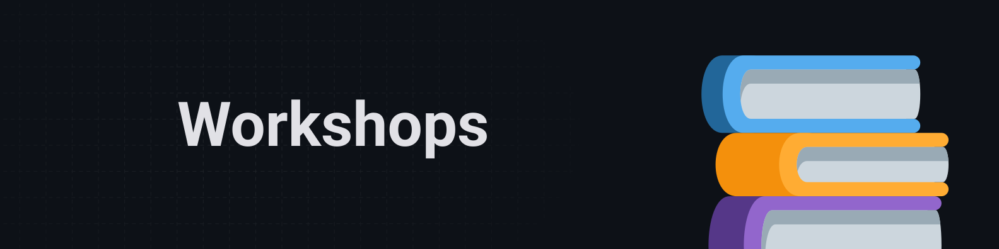

   

   

  

   

   

   

 

## About

This repository centralizes exercises, challenges, and practical projects involving:

- JavaScript/TypeScript
- Node.js
- ReactJS
- React Native

The goal is to track the continuous evolution with the JavaScript stack.

## Branches

The projects contained in this repository are divided into branches:

- [`main`](https://github.com/omarcoaur3lio/formacao-js-ts/tree/main) → Base structure and starting point for new tracks.
- [`nodejs-ignite-2026`](https://github.com/omarcoaur3lio/formacao-js-ts/tree/nodejs-ignite-2026) → Projects from the **Ignite 2026** track by Rocketseat.
- [`reactjs-ignite-2025`](https://github.com/omarcoaur3lio/formacao-js-ts/tree/reactjs-ignite-2025) → Projects from the **Ignite 2025** track by Rocketseat.
- [`reactjs-ignite-2022`](https://github.com/omarcoaur3lio/formacao-js-ts/tree/reactjs-ignite-2022) → Projects from the **Ignite 2022** track by Rocketseat.
- [`workshops`](https://github.com/omarcoaur3lio/formacao-js-ts/tree/workshops) → Standalone projects, events, bootcamps, and tests.

New branches may appear as new trainings are started.
