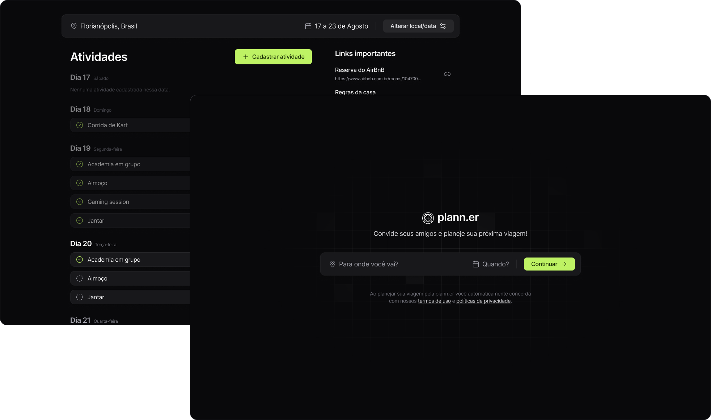

   

   

   

   

The purpose of this branch is to store projects developed as a study, which may be of a concept, technology, design pattern or development methodology.

# 📚 Projects

Click on the project screenshots to access the project source code.

### Nearby

A benefits club app, similar to iFood, where you can find nearby partner establishments, activate coupons, and enjoy exclusive benefits. Developed in Kotlin to reinforce native Android app development concepts.

<table>
    <tbody>
      <tr>
         <td><h4>Screenshot</h4></td>
         <td width="50%"><h4>Objectives</h4></td>
      </tr>
      <tr>
         <td align="center">
            
         </td>
         <td>
            <ul>
               <li>Kotlin Language Fundamentals</li>
               <li>Jetpack Compose Fundamentals</li>
               <li>Using the Coil library for performant image loading</li>
            </ul>
         </td>
      </tr>
   </tbody>
</table>

### in.orbit

Web application for registering goals to be achieved during the week.

<table>
    <tbody>
      <tr>
         <td><h4>Screenshot</h4></td>
         <td width="50%"><h4>Objectives</h4></td>
      </tr>
      <tr>
         <td align="center">
            
         </td>
         <td>
            <ul>
               <li>Javascript Fundamentals with React</li>
               <li>Styling with TailwindCSS</li>
               <li>API Consumption Using React Query</li>
               <li>API Creation with Fastify</li>
               <li>Using Drizzle ORM</li>
               <li>SQL Query Development for PostgreSQL Databases</li>
            </ul>
         </td>
      </tr>
   </tbody>
</table>

### Planner

An application for planning trips with friends, recording activities, and sharing useful links. The front-end project was developed in React, and the API was developed in NodeJS.

<table>
    <tbody>
      <tr>
         <td><h4>Screenshot</h4></td>
         <td width="50%"><h4>Objectives</h4></td>
      </tr>
      <tr>
         <td align="center">
            
         </td>
         <td>
            <ul>
               <li>React Fundamentals</li>
               <li>Styling with TailwindCSS</li>
               <li>API Consumption with Axios</li>
               <li>API Creation with Fastify</li>
               <li>Error Handling</li>
               <li>Sending Email with NodeMailer</li>
            </ul>
         </td>
      </tr>
   </tbody>
</table>

### Pass.in

A full-stack application (backend, web, and mobile) for managing attendees in in-person events. The tool allows organizers to register an event and open a public registration page. Registered attendees can issue a check-in pass on the day of the event. The system will scan the attendee's pass to allow entry to the event.

<table>
    <tbody>
      <tr>
         <td><h4>Screenshot</h4></td>
         <td width="50%"><h4>Objectives</h4></td>
      </tr>
      <tr>
         <td align="center">
            
         </td>
         <td>
            <ul>
               <li>React Fundamentals (state, properties, immutability, etc.)</li>
               <li>Using LocalStorage</li>
               <li>Using URL State</li>
               <li>Using Expo</li>
               <li>Using NativeWind</li>
               <li>Data Persistence with Zustand and AsyncStorage</li>
               <li>Animations with React Reanimated and Moti</li>
            </ul>
         </td>
      </tr>
   </tbody>
</table>