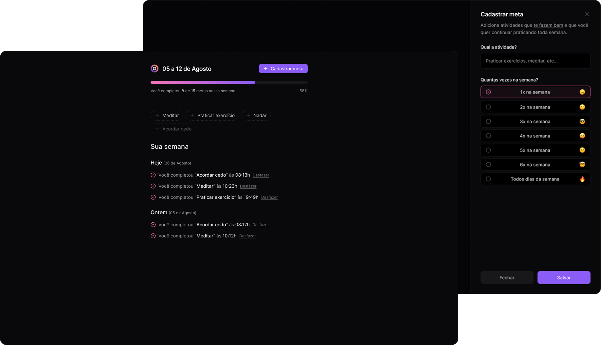
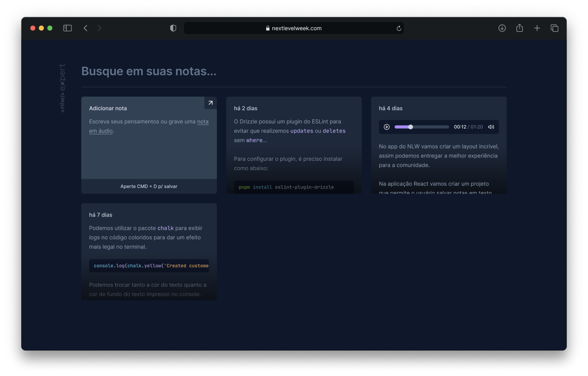

   

   

   

   

The purpose of this branch is to store projects developed as a study, which may be of a concept, technology, design pattern or development methodology.

# 📚 Projects

Click on the project screenshots to access the project source code.

### Nearby

A benefits club app, similar to iFood, where you can find nearby partner establishments, activate coupons, and enjoy exclusive benefits. Developed in Kotlin to reinforce native Android app development concepts.

<table>
    <tbody>
      <tr>
         <td><h4>Screenshot</h4></td>
         <td width="50%"><h4>Objectives</h4></td>
      </tr>
      <tr>
         <td align="center">
            
         </td>
         <td>
            <ul>
               <li>Kotlin Language Fundamentals</li>
               <li>Jetpack Compose Fundamentals</li>
               <li>Using the Coil library for performant image loading</li>
            </ul>
         </td>
      </tr>
   </tbody>
</table>

### in.orbit

Web application for registering goals to be achieved during the week.

<table>
    <tbody>
      <tr>
         <td><h4>Screenshot</h4></td>
         <td width="50%"><h4>Objectives</h4></td>
      </tr>
      <tr>
         <td align="center">
            
         </td>
         <td>
            <ul>
               <li>Javascript Fundamentals with React</li>
               <li>Styling with TailwindCSS</li>
               <li>API Consumption Using React Query</li>
               <li>API Creation with Fastify</li>
               <li>Using Drizzle ORM</li>
               <li>SQL Query Development for PostgreSQL Databases</li>
            </ul>
         </td>
      </tr>
   </tbody>
</table>

### Planner

An application for planning trips with friends, recording activities, and sharing useful links. The front-end project was developed in React, and the API was developed in NodeJS.

<table>
    <tbody>
      <tr>
         <td><h4>Screenshot</h4></td>
         <td width="50%"><h4>Objectives</h4></td>
      </tr>
      <tr>
         <td align="center">
            
         </td>
         <td>
            <ul>
               <li>React Fundamentals</li>
               <li>Styling with TailwindCSS</li>
               <li>API Consumption with Axios</li>
               <li>API Creation with Fastify</li>
               <li>Error Handling</li>
               <li>Sending Email with NodeMailer</li>
            </ul>
         </td>
      </tr>
   </tbody>
</table>

### Pass.in

A full-stack application (backend, web, and mobile) for managing attendees in in-person events. The tool allows organizers to register an event and open a public registration page. Registered attendees can issue a check-in pass on the day of the event. The system will scan the attendee's pass to allow entry to the event.

<table>
    <tbody>
      <tr>
         <td><h4>Screenshot</h4></td>
         <td width="50%"><h4>Objectives</h4></td>
      </tr>
      <tr>
         <td align="center">
            
         </td>
         <td>
            <ul>
               <li>React Fundamentals (state, properties, immutability, etc.)</li>
               <li>Using LocalStorage</li>
               <li>Using URL State</li>
               <li>Using Expo</li>
               <li>Using NativeWind</li>
               <li>Data Persistence with Zustand and AsyncStorage</li>
               <li>Animations with React Reanimated and Moti</li>
            </ul>
         </td>
      </tr>
   </tbody>
</table>

### NLW Notes

Application for creating text notes or transcribing audio to text using the browser's native SpeechRecognition API.

<table>
    <tbody>
      <tr>
         <td><h4>Screenshot</h4></td>
         <td width="50%"><h4>Objectives</h4></td>
      </tr>
      <tr>
         <td align="center">
            
         </td>
         <td>
            <ul>
               <li>React Fundamentals (states, properties, immutability, etc.)</li>
               <li>Using LocalStorage</li>
               <li>Using the SpeechRecognition API</li>
            </ul>
         </td>
      </tr>
   </tbody>
</table>

### Upload.ai

The project consists of a generator of video descriptions and titles based on the transcription of their content using artificial intelligence.

<table>
    <tbody>
      <tr>
         <td><h4>Screenshot</h4></td>
         <td width="50%"><h4>Objectives</h4></td>
      </tr>
      <tr>
         <td align="center">
            
         </td>
         <td>
            <ul>
               <li>React Fundamentals</li>
               <li>Creating an interface with RadixUI</li>
               <li>Using the OpenAI API</li>
            </ul>
         </td>
      </tr>
   </tbody>
</table>

### Bora Codar

This project contains small software development challenges, covering various topics, technologies, libraries, etc.

<table>
    <tbody>
      <tr>
         <td><h4>Screenshot</h4></td>
         <td width="50%"><h4>Objectives</h4></td>
      </tr>
      <tr>
         <td align="center">
            
         </td>
         <td>
            <ul>
               <li>Javascript/Typescript Fundamentals</li> 
               <li>Use of HTML/CSS</li>
            </ul>
         </td>
      </tr>
   </tbody>
</table>

### Habits

With this application, you can create a list of habits to incorporate into your routine, and track, through the summary presented in the application, how often each habit is being practiced, allowing you to visualize your progress over time and motivate yourself to move forward.

<table>
    <tbody>
      <tr>
         <td><h4>Screenshot</h4></td>
         <td width="50%"><h4>Objectives</h4></td>
      </tr>
      <tr>
         <td align="center">
            
         </td>
         <td>
            <ul>
               <li>Javascript/Typescript Fundamentals</li>
               <li>Using TailwindCSS</li>
               <li>Using the NativeWind library</li>
               <li>Using the Reanimated library</li>
               <li>Using Fastify</li>
            </ul>
         </td>
      </tr>
   </tbody>
</table>

### NLW Copa

Full-stack application where we can create "pools" to make predictions for the 2022 World Cup matches. The application has a Web interface made in React (only for creating pools), a back-end developed in Node.js and a mobile App made in React Native.

<table>
    <tbody>
      <tr>
         <td><h4>Screenshot</h4></td>
         <td width="50%"><h4>Objectives</h4></td>
      </tr>
      <tr>
         <td align="center">
            
         </td>
         <td>
            <ul>
               <li>Javascript/Typescript Fundamentals</li>
               <li>Using TailwindCSS</li>
               <li>Using the NativeWind library</li>
               <li>Using the Reanimated library</li>
               <li>Using Fastify</li>
               <li>Using Prima ORM + Zod</li>
            </ul>
         </td>
      </tr>
   </tbody>
</table>

### Synter Help

This application aims to register tasks (or requests 🙃) to be performed/fulfilled. The app allows you to register new requests in addition to displaying registered tasks filtered by their status (in progress or completed).

<table>
    <tbody>
      <tr>
         <td><h4>Screenshot</h4></td>
         <td width="50%"><h4>Objectives</h4></td>
      </tr>
      <tr>
         <td align="center">
            
         </td>
         <td>
            <ul>
               <li>Javascript/Typescript Fundamentals</li>
               <li>Using Expo</li>
               <li>Expo bare workflow</li>
               <li>Using NativeBase</li>
            </ul>
         </td>
      </tr>
   </tbody>
</table>

### FeedbackWidget

The App aims to be a means of sending feedback to the application in which it is inserted, be it web or mobile.

<table>
    <tbody>
      <tr>
         <td><h4>Screenshot</h4></td>
         <td width="50%"><h4>Objectives</h4></td>
      </tr>
      <tr>
         <td align="center">
            
         </td>
         <td>
            <ul>
               <li>Javascript/Typescript Fundamentals</li> 
               <li>Using Vite</li>
            </ul>
         </td>
      </tr>
   </tbody>
</table>

### Letmeask

The app aims to help content creators receive questions through the platform's ranking system based on likes ✨.

How does it work? Create a room to receive questions. Once created, a code will be generated, and you can share it so others can join the room and submit questions.

<table>
    <tbody>
      <tr>
         <td><h4>Screenshot</h4></td>
         <td width="50%"><h4>Objectives</h4></td>
      </tr>
      <tr>
         <td align="center">
            
         </td>
         <td>
            <ul>
               <li>Javascript/Typescript Fundamentals</li>
               <li>Using Firebase</li>
            </ul>
         </td>
      </tr>
   </tbody>
</table>

### Podcastr

Podcastr is an application designed to serve as a podcast website. This application allows you to practice techniques such as audio handling, static page generation, and connection to the application's backend.

<table>
    <tbody>
      <tr>
         <td><h4>Screenshot</h4></td>
         <td width="50%"><h4>Objectives</h4></td>
      </tr>
      <tr>
         <td align="center">
            
         </td>
         <td>
            <ul>
               <li>Javascript/Typescript Fundamentals</li> 
               <li>Using NextJS</li>
            </ul>
         </td>
      </tr>
   </tbody>
</table>