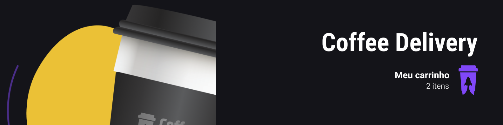
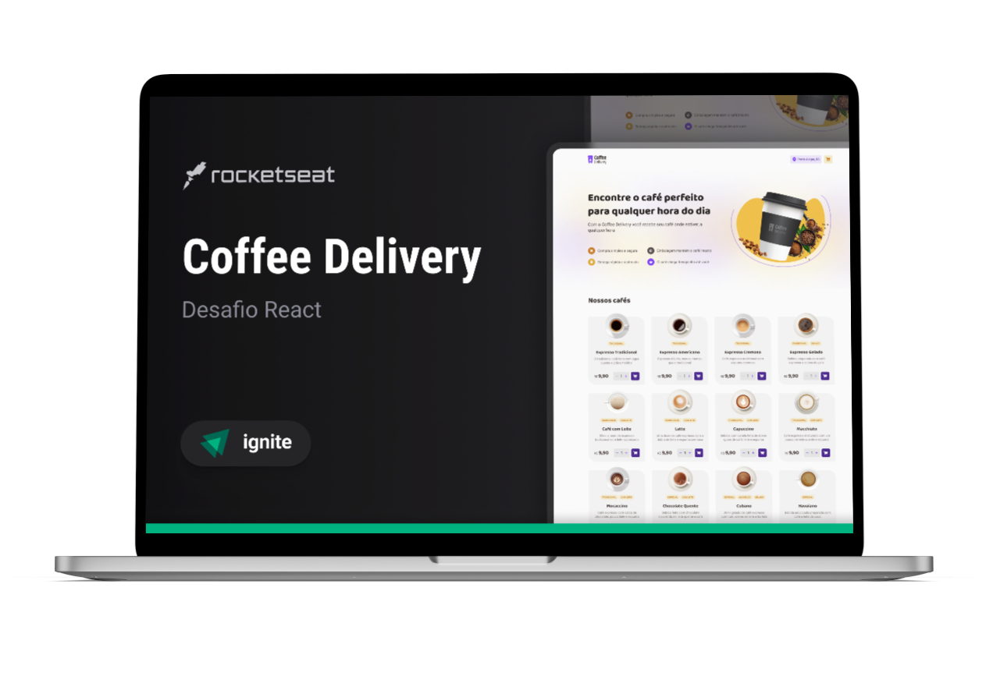

  

 

  
  <a aria-label="Completed" href="https://rocketseat.com.br/">
    </img>
</a>
    

## :speech_balloon: About

This project was developed in the React JS track of the Ignite [Rocketseat](https://www.rocketseat.com.br) program.

 

The project consists of an application to manage a shopping cart for a fictional coffee shop, which contains the following functionalities:

- List of products (coffees) available for purchase;
- Add a specific number of items to the cart;
- Increase or remove the number of items in the cart;
- Form for the user to fill in their address;
- Display the total items in the cart in the application Header;
- Display the total value of the sum of items in the cart multiplied by the value;

 

The main concepts exercised during development were:

- States
- ContextAPI
- LocalStorage
- Immutability of the state
- Lists and keys in ReactJS
- Properties
- Componentization

## :camera: Preview

  

## :rocket: Technologies

  
  
  
 

 

  Made with :purple_heart:

