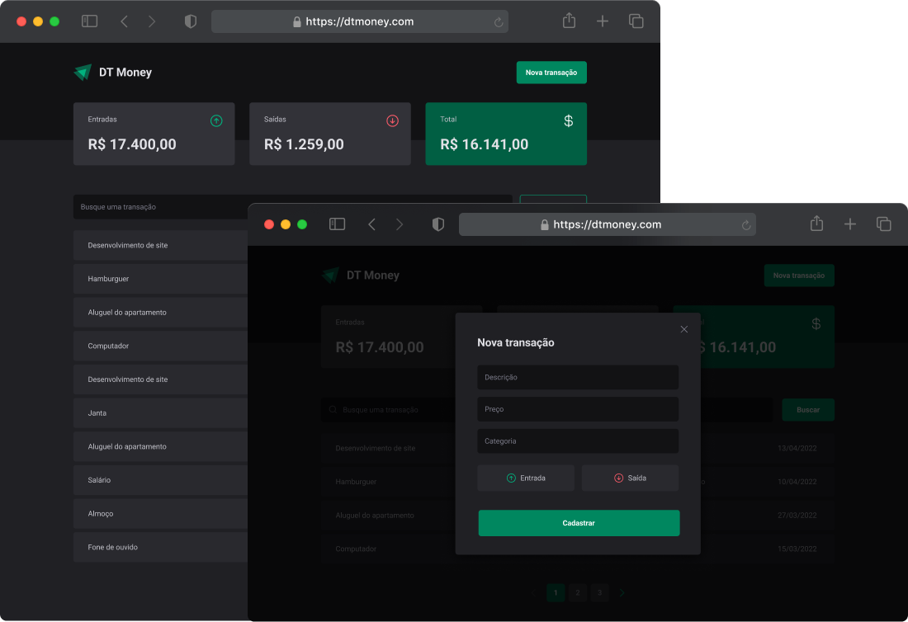

  

 

  
  <a aria-label="Completed" href="https://rocketseat.com.br/">
    </img>
</a>
    

## :speech_balloon: About

This project was developed during the third module of the React JS track of [Rocketseat](https://www.rocketseat.com.br) Ignite program.
 

The DT Money project is a financial control application that allows you to register inputs and outputs, perform searches, filters and calculate the total of registered transactions.

Below are the main functions of the application and the main points that were taken into consideration during development.

- Search and list of transactions ordered by registration date;
- Registration of transactions in an API;
- Creation of accessible components with Radix UI;
- Prevention of unnecessary renderings of components;

 

Below are some of the concepts put into practice during development:

- React Hooks (useState, useCallback, useMemo)
- API consumption with axios and the JS fetch API
- Use of fake API (json-server)
- Performance analysis
- Styled Components
- ContextAPI
- States and immutability

## :camera: Preview

  

## :rocket: Technologies Used

  
  
  
  
  
  
  
 

 

  Made with :purple_heart:

