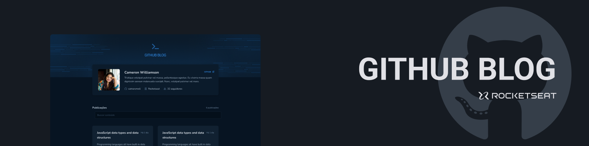

<p align="center">
  
</p>
<br>
<p align="center">
  <a href="https://www.linkedin.com/in/omarcoaur3lio/">
    
  </a>
  <a aria-label="Completed" href="https://rocketseat.com.br/">
    </img>
</a>
    <a href="./README_en.md">
    
</a>
</p>

## :speech_balloon: Visão Geral

Este projeto foi desenvolvido durante o terceiro módulo da trilha de React JS do programa Ignite da [Rocketseat](https://www.rocketseat.com.br).
<br />
O projeto consiste em utilizar as issues de um repositórios do GitHub como fonte de conteúdo para um blog.
A aplicação utiliza a [GitHub Users API](https://docs.github.com/pt/rest/users/users#get-a-user) para exibir as informações do usuários, a [GitHub Issues API](https://docs.github.com/pt/rest/issues/issues#get-an-issue) para exibição completa de uma issue (post) e a [GitHub Search API](https://docs.github.com/pt/rest/search) para buscar por termos específicos nas issues do repositório.

### Funcionalidades

- Perfil do Usuário: Exibe informações do usuário do GitHub, como avatar, número de seguidores, nome, etc.
- Listagem de Posts: Listagem de todas as issues (posts) do repositório, permitindo filtrar e visualizar um resumo do conteúdo.
- Página de Post: Permite a visualização completa de uma issue, transformando o conteúdo escrito em Markdown para HTML.


<br />

A seguir, alguns dos conceitos postos em prática durante o desenvolvimento:

- React Hooks (useState, useCallback, useContext)
- Consumo de API com axios
- Styled Components
- ContextAPI
- Roteamento com React Router
- Estados e imutabilidade

## :camera: Preview

<div align="center">
  
</div>

## :rocket: Executar o projeto

```shell
# clone o repositório
git clone https://github.com/omarcoaur3lio/github-blog.git

# acesse a pasta do projeto
cd github-blog
```

Para rodar o projeto é necessário criar um arquivo `.env` na raiz do projeto contendo o username do usuário no GitHub e o nome do repositório que contém as issues. 

```shell
# crie o arquivo de configuração
touch .env

# ou utilize o arquivo de exemplo
mv env.sample .env
```

Execute o projeto

```shell
# instale as dependências
npm install

# inicialize o projeto
npm run dev
```

## :rocket: Tecnologias Utilizadas

  <a href="https://react.dev/">
    
  </a>
  <a href="https://www.typescriptlang.org/">
    
  </a>
  <a href="https://styled-components.com/">
    
  </a>
  <a href="https://axios-http.com/">
    
  </a>
  <a href="https://axios-http.com/">
    
  </a>
  <a href="https://axios-http.com/">
    
  </a>
<br>

<br />

<p align="center">
  Feito com :purple_heart:
</p>
