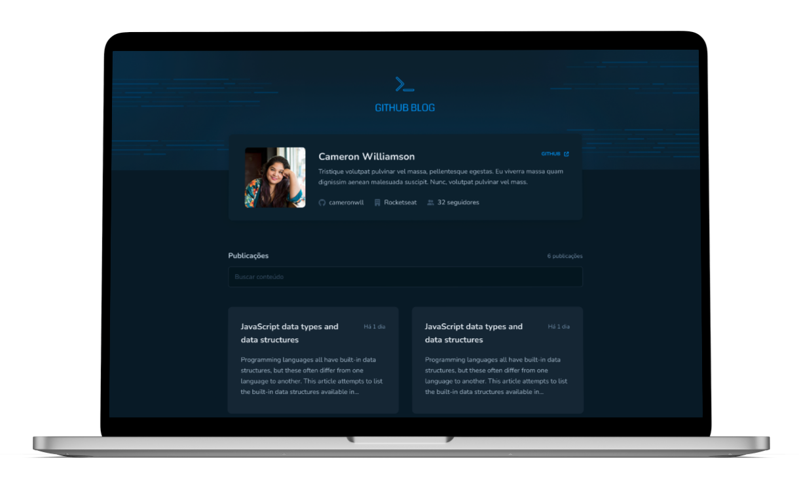

<p align="center">
  
</p>
<br>
<p align="center">
  <a href="https://www.linkedin.com/in/omarcoaur3lio/">
    
  </a>
  <a aria-label="Completed" href="https://rocketseat.com.br/">
    </img>
</a>
    <a href="./README.md">
    
</a>
</p>

## :speech_balloon: Overview

This project was developed during the third module of the React JS track of [Rocketseat's](https://www.rocketseat.com.br) Ignite program.
<br />
The project consists of using issues from a GitHub repository as a source of content for a blog.
The application uses the [GitHub Users API](https://docs.github.com/pt/rest/users/users#get-a-user) to display user information, the [GitHub Issues API](https://docs.github.com/pt/rest/issues/issues#get-an-issue) for full display of an issue (post) and the [GitHub Search API](https://docs.github.com/pt/rest/search) to search for specific terms in the repository issues.

### Features

- User Profile: Displays GitHub user information such as avatar, number of followers, name, etc.
- Post Listing: Listing of all issues (posts) in the repository, allowing you to filter and view a summary of the content.
- Post Page: Allows complete visualization of an issue, transforming content written in Markdown into HTML.


<br />

Below are some of the concepts put into practice during development:

- React Hooks (useState, useCallback, useContext)
- API consumption with axios
- Styled Components
- ContextAPI
- Routing with React Router
- States and immutability

## :camera: Preview

<div align="center">
  
</div>

## :rocket: Execute the project

```shell
# clone the repository
git clone https://github.com/omarcoaur3lio/github-blog.git

# access the project folder
cd github-blog
```

To run the project, it is necessary to create a `.env` file in the root of the project containing the user's GitHub username and the name of the repository that contains the issues.

```shell
# create the configuration file
touch .env

# or use the example file
mv env.sample .env
```

Run the project

```shell
# install the dependencies
npm install

# initialize the project
npm run dev
```

## :rocket: Technologies

  <a href="https://react.dev/">
    
  </a>
  <a href="https://www.typescriptlang.org/">
    
  </a>
  <a href="https://styled-components.com/">
    
  </a>
  <a href="https://axios-http.com/">
    
  </a>
  <a href="https://axios-http.com/">
    
  </a>
  <a href="https://axios-http.com/">
    
  </a>
<br>

<br />

<p align="center">
  Feito com :purple_heart:
</p>
