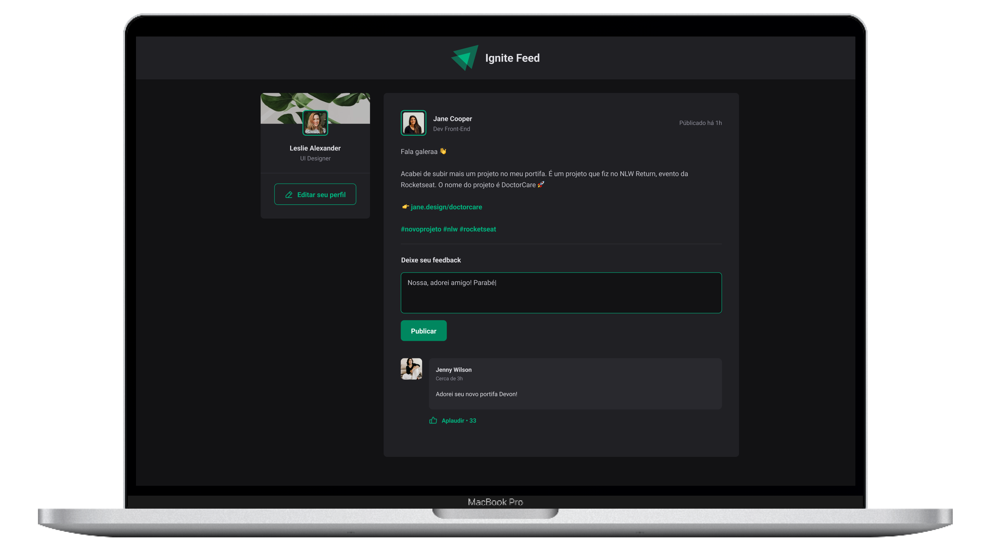

<p>
    <h1 align="center">
        
        &nbsp;
        Ignite Feed
        <br>

<a href="https://www.linkedin.com/in/omarcoaur3lio/">
    
</a>

<a aria-label="Completed" href="https://rocketseat.com.br/">
    </img>
</a>

<a href="./README_en.md">
    
</a>
    </h1>
</p>
<br>

<p align="center">
  <a href="#speech_balloon-Sobre">Sobre</a>&nbsp;&nbsp;&nbsp;|&nbsp;&nbsp;&nbsp;
  <a href="#camera-Preview">Preview</a>&nbsp;&nbsp;&nbsp;|&nbsp;&nbsp;&nbsp;
  <a href="#hammer_and_wrench-Instalação">Instalação</a>&nbsp;&nbsp;&nbsp;|&nbsp;&nbsp;&nbsp;
  <a href="#rocket-Tecnologias">Tecnologias</a>
</p>

## :speech_balloon: Sobre

Esta aplicação foi desenvolvida durante o primeiro módulo do programa de treinamento Ignite, da [Rocketseat](https://www.rocketseat.com.br/ignite). Durante o desenvolvimento foram abordados os principais conceitos do ReactJS, utilização de alguns `Hooks` como o `useEffect` e `useState`, além de uma introdução a TypeScript e tecnologias como o Vite.

O Ignite Feed simula uma rede social, onde os usuários conectados podem enviar comentários aos posts publicados, podendo ainda deleta-los e dar likes (`Aplaudir`).


## :camera: Preview 
<div align="center">
  
</div>

## :hammer_and_wrench: Instalação

Para executar a aplicação em sua máquina é necessário que possua o [Git](https://git-scm.com/book/pt-br/v2/Come%C3%A7ando-Instalando-o-Git) e o [NodeJS](https://nodejs.org/pt-br/download/package-manager/) já instalados, e também um gerenciador de pacotes como o [NPM](https://www.npmjs.com/) ou [Yarn](https://yarnpkg.com/).
Com essas ferramentas instaladas:

1. Clone este repositório
```shell
git clone https://github.com/omarcoaur3lio/ignite-feed.git
```

2. Navegue até o diretório criado
```shell
cd ignite-feed
```

3. Instale as dependências do projeto
```shell
yarn # ou npm i
```

3. Execute a aplicação
```shell
yarn dev # ou npm run dev
```
O aplicativo estará disponível para acesso em seu navegador em http://localhost:3000

## :rocket: Tecnologias

- [Vite](https://vitejs.dev/)
- [ReactJS](https://reactjs.org/)
- [TypeScript](https://www.typescriptlang.org/)
- [Date FNS](https://date-fns.org/)
- [Phosphor Icons](https://phosphoricons.com/)

<p align="center">
Feito com :purple_heart:
</p>
