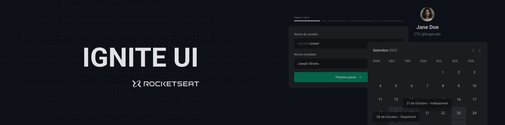

  

  
  <a aria-label="Completed" href="https://rocketseat.com.br/">
    </img>
</a>
    

## :speech_balloon: Visão Geral

Esse projeto foi construído durante o programa Ignite da [Rocketseat](www.rocketseat.com.br) e teve como objetivo construir um design system para o projet Ignite Call.  
O DS foi desenvolvido em um monorepo composto pelos pacotes de tokens (cores, tamanhos, tipografia, espaçamentos, etc...), configuração (TypeScript e ESLint), componentes (desenvolvidos com ReacJS) e documentação dos componentes (Storybook).

## :camera: Preview

  

### Assuntos estudados

A seguir, alguns dos conceitos postos em prática durante o desenvolvimento:

- Criação e utilização de monorepos
  - Utilização do Turborepo
    - Utilização de cache e remote caching
- Criação e reutilização de componentes
  - Documentação dos componentes com o Storybook
  - CSS-in-JS com Stitches
- Publicação de pacotes no NPM
- Gerenciamento de versões e CI/CD no NPM com changesets
- CI/CD com Github Actions

## :rocket: Tecnologias Utilizadas

  
  
  
  
  
  
 

 

  Feito com :purple_heart:

